# CryptoTracker App

## Project overview
CryptoTracker is a comprehensive mobile application designed to keep you informed about cryptocurrency markets. It allows users to track real-time prices, set up alerts for price changes, and analyze historical price data through detailed charts.

## Features
- **Real-Time Price Tracking**: Stay updated with live prices of a wide range of cryptocurrencies. The app ensures that you get the latest market data at your fingertips.
- **Interactive Price Charts**: Access detailed historical price charts to analyze trends and make informed decisions. The charts are designed to be intuitive and provide valuable insights into market behavior.
- **Favorites Management**: Easily track your favorite cryptocurrencies by adding them to your favorites list. Quickly access their current prices and market trends from a dedicated section in the app.

## Usage
1. **Home Screen**: Upon launching the app, you will see a list of cryptocurrencies with their current prices. Use the search function to find specific coins quickly.
2. **Detailed View**: Tap on any cryptocurrency to view more detailed information, including historical price charts and market statistics.
3. **Favorites**: Add coins to your favorites by selecting the star icon next to their names. Access your favorites from the dedicated tab to keep track of the coins you care about the most.

## Technologies
- **Flutter**: Utilized for building a responsive and user-friendly mobile interface. 
- **RESTful API Integration**: Provides real-time cryptocurrency data from reliable sources.

## Screenshots

### Dark Theme

| **Homepage Markets 1**                    | **Homepage Markets 2**                    | **Homepage Favorite**                    |
|--------------------------------------------|-------|-------|
| 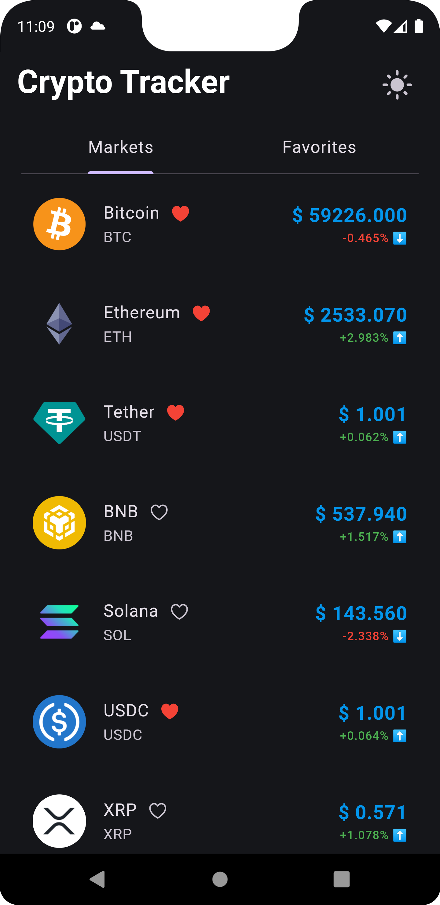 | 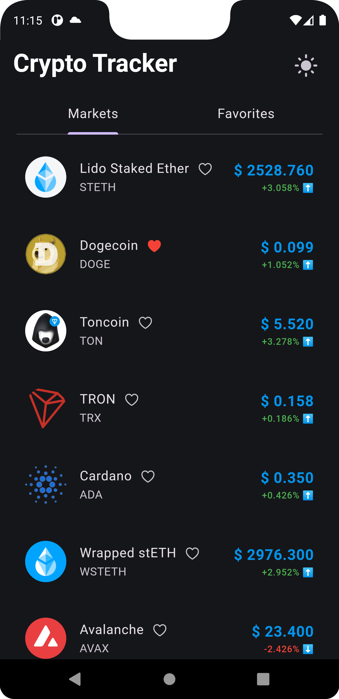 | 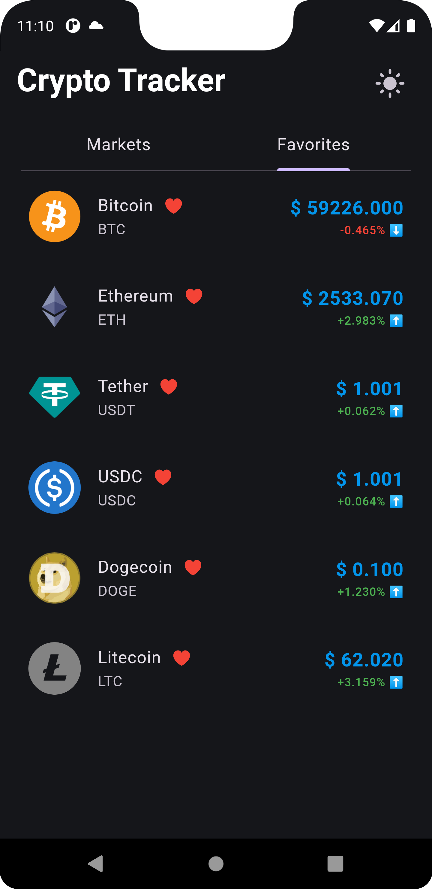 | 
| **Details 1 Day**                         | **Details 7 Day**                         | **Details 15 Day**                       |
| 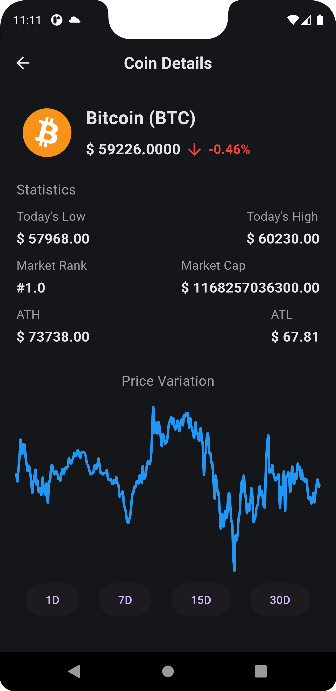 | 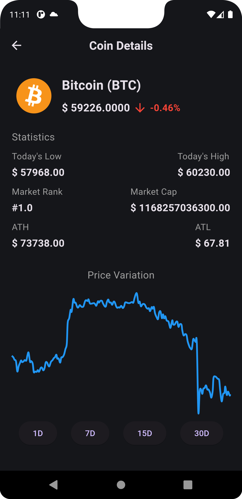 | 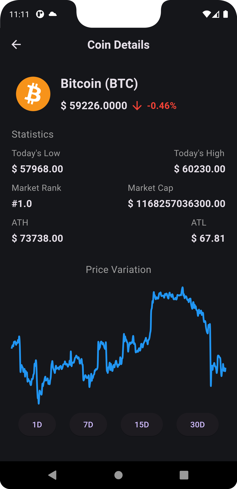 |

### Light Theme

| **Homepage Markets 1**                    | **Homepage Markets 2**                    | **Homepage Favorite**                    |
|--------------------------------------------|-------|-------|
| 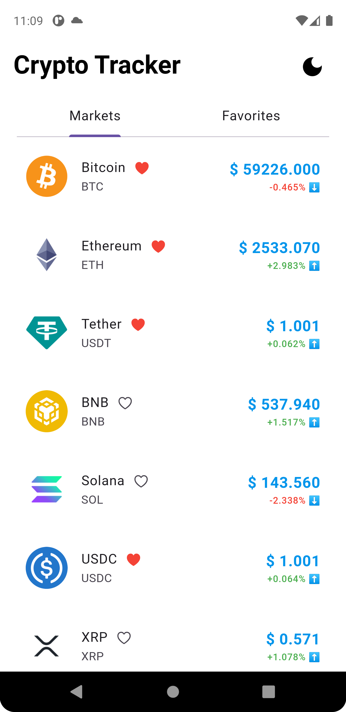 | 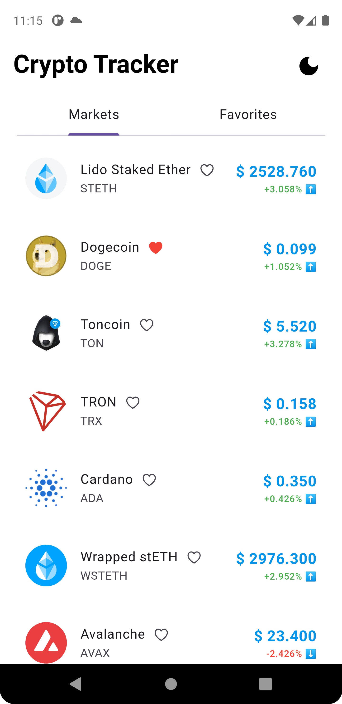 | 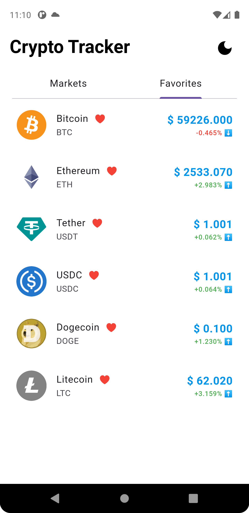 |
| **Details 1 Day**                         | **Details 7 Day**                         | **Details 15 Day**                       |
| 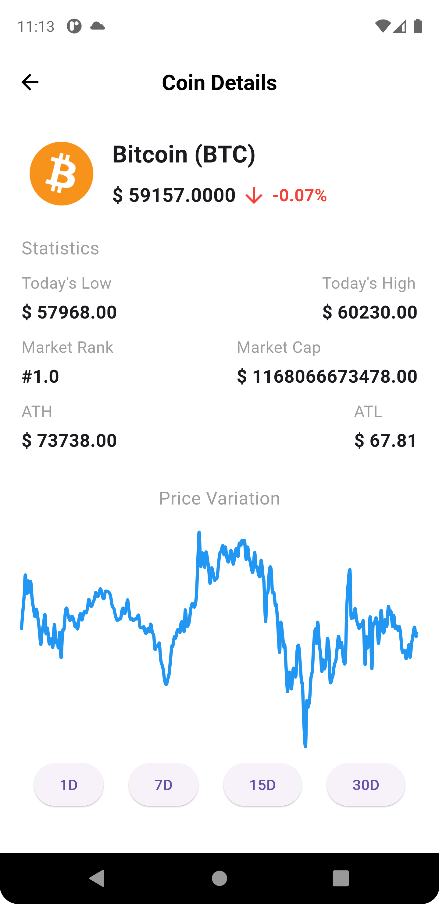 | 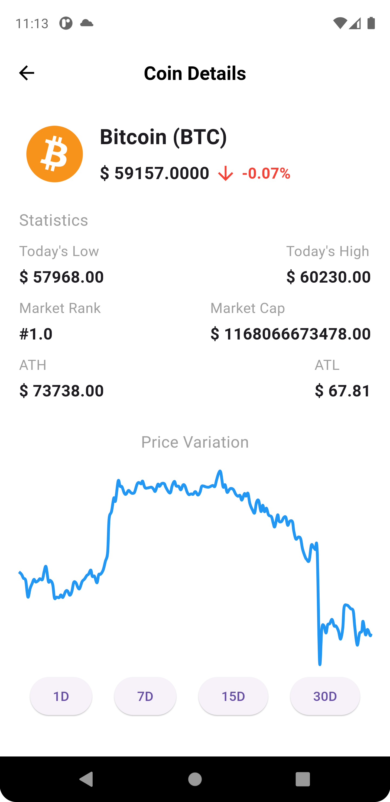 |  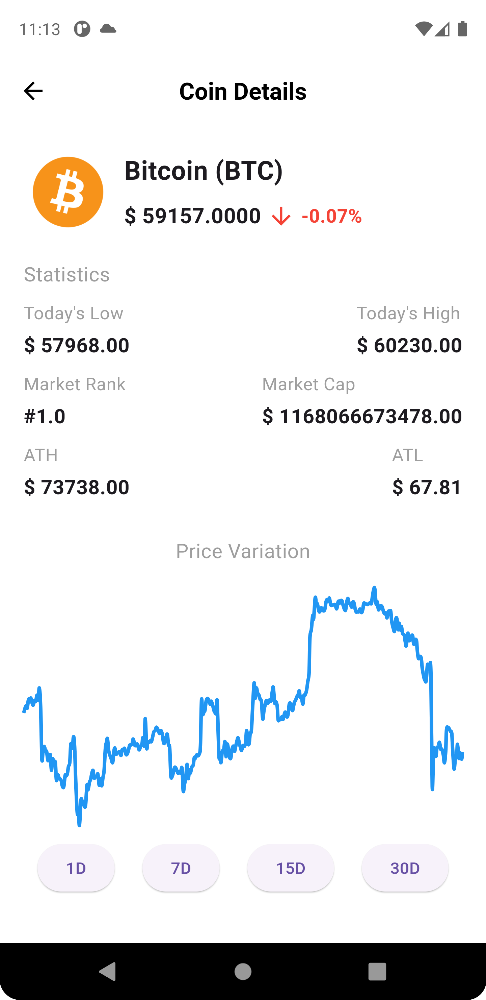 |
